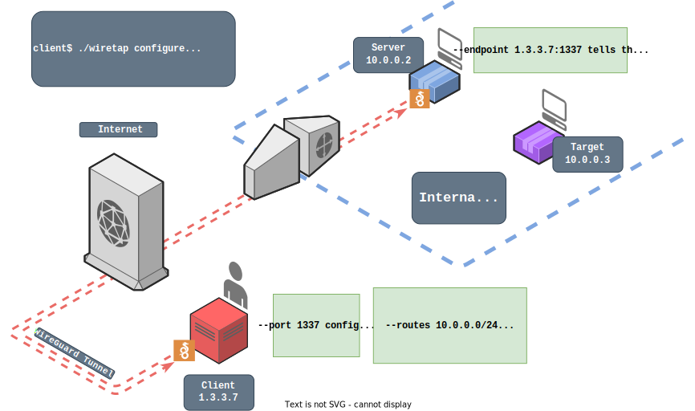
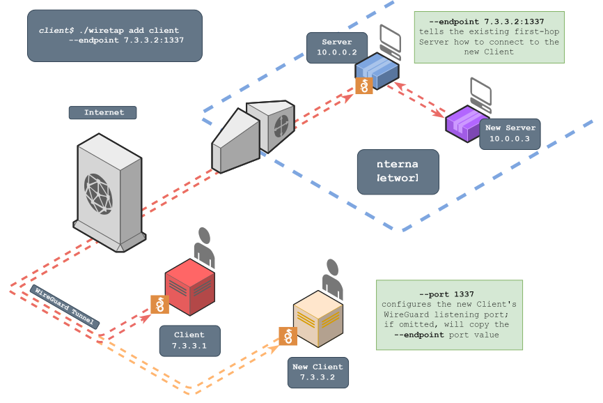
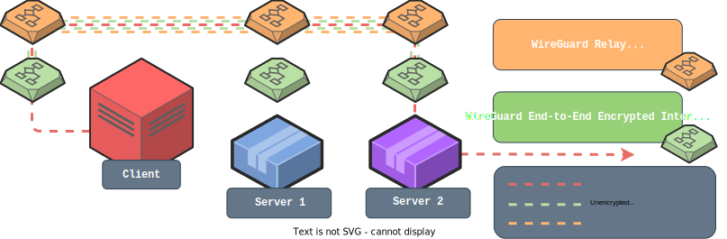

<div align="center">

#  Wiretap

Wiretap is a transparent, VPN-like proxy server that tunnels traffic via WireGuard and requires no special privileges to run.
</div>

In this diagram, the client has generated and installed WireGuard configuration files that will route traffic destined for `10.0.0.0/24` through a WireGuard interface. Wiretap is then deployed to the server with a configuration that connects to the client as a WireGuard peer. The client can then interact with resources local to the server as if on the same network and chain additional servers to reach new networks. Access to the Wiretap network can also be shared with other clients.

<div align="center">


</div>

## Quick Start

1. Download binaries from the [releases](https://github.com/sandialabs/wiretap/releases) page, one for your client machine and one for your server (if different os/arch)
2. Run `./wiretap configure --port <port> --endpoint <socket> --routes <routes>` with the appropriate arguments
3. Import the resulting `wiretap.conf` and `wiretap_relay.conf` files into WireGuard on the client machine
4. Copy and paste the server command output that best suits your target system into Wiretap on the server machine
5. Add more servers and clients as needed with the `add` subcommand

## Requirements

### Client Systems

* WireGuard - https://www.wireguard.com/install/
* Privileged access to configure WireGuard

### Server Systems

* Bidirectional UDP access to client on one port. By default the server initiates the handshake to the client because it is more likely to have outbound UDP than inbound, but the reverse is easily configurable

While not ideal, Wiretap can still work with TCP instead of UDP. See the experimental [TCP Tunneling](#tcp-tunneling) section for a step-by-step guide.

## Installation

Grab a binary from the [releases](https://github.com/sandialabs/wiretap/releases) page. You may want two binaries if the OS/ARCH are different on the client and server machines.

If you want to compile it yourself or can't find the OS/ARCH you're looking for, install Go (>=1.20) from https://go.dev/dl/ and use the provided [Makefile](./src/Makefile).

## Usage

### Configure

<div align="center">


</div>

On the client machine, run Wiretap in configure mode to build a config

```bash
./wiretap configure --port <port> --endpoint <socket> --routes <routes>
```

* `--port` sets the listening port of the Client's Relay interface. It's set to 51820 by default. Note that the E2EE listening port does not need to be accessible to the Server
* `--endpoint` tells the Server how to connect to the Client's Relay interface (the E2EE interfaces already know how to talk to each other if the Relay interfaces are working)
* `--routes` is the equivalent of WireGuard's AllowedIPs setting. This tells the Client to route traffic that matches these IP ranges through Wiretap

Following the example in the diagram:
```bash
./wiretap configure --port 1337 --endpoint 1.3.3.7:1337 --routes 10.0.0.0/24
```
```
Configurations successfully generated.
Import the two configs into WireGuard locally and pass the arguments below to Wiretap on the remote machine.

config: wiretap_relay.conf
────────────────────────────────
[Interface]
PrivateKey = cGsJkcVIajZW7kfN5SMwijmMx59ke7FZ+qdZOcsNDE0=
Address = 172.16.0.1/32
Address = fd:16::1/128
ListenPort = 1337

[Peer]
PublicKey = kMj7HwfYYFO/XEHNFK2kz9cBd7vTHk63fhygyuYLMzI=
AllowedIPs = 172.17.0.0/24,fd:17::/48
────────────────────────────────

config: wiretap.conf
────────────────────────────────
[Interface]
PrivateKey = YCTRVwB4xOEcBtifVmhjMhRYL7+DOlDP5VdHZGclZGg=
Address = 172.19.0.1/32
Address = fd:19::1/128
ListenPort = 51821
MTU = 1340

[Peer]
PublicKey = 3ipWthpJzqVo5wcb1TSDS1M8YOiBQYBPmbj3mVD/5Fg=
AllowedIPs = 10.0.0.0/24,::2/128
Endpoint = 172.17.0.2:51821
────────────────────────────────

server config: wiretap_server.conf

server command:
POSIX Shell:  WIRETAP_RELAY_INTERFACE_PRIVATEKEY=WDH8F6rSUZDyQFfEsRjWLCnapU254qrSAfpGyGs+N1Y= WIRETAP_RELAY_PEER_PUBLICKEY=Ta75SvIb2v2V8EDo6oE2Fvsys/CNlkzW+aPjxdY+Dlc= WIRETAP_RELAY_PEER_ENDPOINT=1.3.3.7:1337 WIRETAP_E2EE_INTERFACE_PRIVATEKEY=GKzGBe3qS7JuLp0vMAErBW6lAewvmFowCIbcgwzComg= WIRETAP_E2EE_PEER_PUBLICKEY=cXddDGWCzd5igux4FDv97XBsyLH0SRPehhTz3E2IXBM= WIRETAP_E2EE_PEER_ENDPOINT=172.16.0.1:51821 ./wiretap serve
 PowerShell:  $env:WIRETAP_RELAY_INTERFACE_PRIVATEKEY="WDH8F6rSUZDyQFfEsRjWLCnapU254qrSAfpGyGs+N1Y="; $env:WIRETAP_RELAY_PEER_PUBLICKEY="Ta75SvIb2v2V8EDo6oE2Fvsys/CNlkzW+aPjxdY+Dlc="; $env:WIRETAP_RELAY_PEER_ENDPOINT="1.3.3.7:1337"; $env:WIRETAP_E2EE_INTERFACE_PRIVATEKEY="GKzGBe3qS7JuLp0vMAErBW6lAewvmFowCIbcgwzComg="; $env:WIRETAP_E2EE_PEER_PUBLICKEY="cXddDGWCzd5igux4FDv97XBsyLH0SRPehhTz3E2IXBM="; $env:WIRETAP_E2EE_PEER_ENDPOINT="172.16.0.1:51821"; .\wiretap.exe serve
Config File:  ./wiretap serve -f wiretap_server.conf
```

> **Note**
> Wiretap uses 2 WireGuard interfaces per node in order to safely and scalably chain together servers. This means your client will bind to more than one port, but only the Relay Interface port needs to be accessible by the Server. See the [How It Works](#how-it-works) section for details. Use `--simple` if your setup requires a single interface on the client

Install the resulting config either by copying and pasting the output or by importing the new `wiretap.conf` and `wiretap_relay.conf` files into WireGuard:

* If using a GUI, select the menu option similar to *Import Tunnel(s) From File*
* If you have `wg-quick` installed, `sudo wg-quick up ./wiretap.conf` and `sudo wg-quick up ./wiretap_relay.conf`

Don't forget to disable or remove the tunnels when you're done (e.g., `sudo wg-quick down ./wiretap.conf` and `sudo wg-quick down ./wiretap_relay.conf`)

### Deploy

On the remote machine, upload the binary and then copy the command with the private and public keys to start Wiretap in server mode:
```powershell
$env:WIRETAP_RELAY_INTERFACE_PRIVATEKEY="WDH8F6rSUZDyQFfEsRjWLCnapU254qrSAfpGyGs+N1Y="; $env:WIRETAP_RELAY_PEER_PUBLICKEY="Ta75SvIb2v2V8EDo6oE2Fvsys/CNlkzW+aPjxdY+Dlc="; $env:WIRETAP_RELAY_PEER_ENDPOINT="1.3.3.7:1337"; $env:WIRETAP_E2EE_INTERFACE_PRIVATEKEY="GKzGBe3qS7JuLp0vMAErBW6lAewvmFowCIbcgwzComg="; $env:WIRETAP_E2EE_PEER_PUBLICKEY="cXddDGWCzd5igux4FDv97XBsyLH0SRPehhTz3E2IXBM="; $env:WIRETAP_E2EE_PEER_ENDPOINT="172.16.0.1:51821"; .\wiretap.exe serve
```

There are two other ways to pass arguments to the server:
1. With a config file: `-f wiretap_server.conf`
2. The legacy method of passing command line arguments (`--endpoint 1.3.3.7:1337 ...`). Be aware that this method exposes arguments to other users on the system. A compromised private key can be used to connect to the client as a peer and/or decrypt traffic

Confirm that the relay interfaces on the client and server have successfully completed a handshake. The client should see successful handshakes in whatever WireGuard interface is running. If using the command-line tools, check with `wg show`. By default the E2EE handshake will not occur until the client sends data.

Now the client should be able to interact with the `routes` specified in the `configure` command!

### Add Server (Optional)

<div align="center">


</div>

The `add server` subcommand is meant to extend the Wiretap network to reach new areas of a target network. One client and at least one server must be configured and deployed before adding another server. Servers can attach to any other server *or* the client itself.

> **Note**
> All servers must be deployed *before* adding additional clients

You can view the state of the network and see API addresses with `./wiretap status`

```bash
./wiretap status
```
```
╭────────────────────────╮
│ Wiretap Network Status │
╰────────────┬───────────╯
             │
  ╭──────────┴──────────╮
  │client               │
  │                     │
  │  relay: Ta75SvIb... │
  │   e2ee: cXddDGWC... │
  │                     │
  ╰──────────┬──────────╯
             │
  ╭──────────┴──────────╮
  │server               │
  │  relay: kMj7HwfY... │
  │   e2ee: 3ipWthpJ... │
  │                     │
  │    api: ::2         │
  │ routes: 10.0.0.0/24 │
  ╰─────────────────────╯
```

If you plan to attach a server directly to the client, the status command just confirms that everything is working as expected and the network layout is correct. If you want to attach a server to another server you must specify the API address in your `add server` command. In the example, we will want to attach to the server with API address `::2`. This command will generate a configuration you can deploy to the new server (through environment variables or a config), just like with the `configure` command:

```bash
./wiretap add server --server-address ::2 --endpoint 10.0.0.2:51820 --routes 10.0.1.0/24
```
```
Configurations successfully generated.
Import the updated config(s) into WireGuard locally and pass the arguments below to Wiretap on the new remote server.

config: wiretap.conf
────────────────────────────────
[Interface]
PrivateKey = YCTRVwB4xOEcBtifVmhjMhRYL7+DOlDP5VdHZGclZGg=
Address = 172.19.0.1/32
Address = fd:19::1/128
ListenPort = 51821
MTU = 1340

[Peer]
PublicKey = 3ipWthpJzqVo5wcb1TSDS1M8YOiBQYBPmbj3mVD/5Fg=
AllowedIPs = 10.0.0.0/24,::2/128
Endpoint = 172.17.0.2:51821

[Peer]
PublicKey = YOVI9nOvjOWTre0OVzrjx8qsYRgyuSLWndv28S2udiQ=
AllowedIPs = 10.0.1.0/24,::3/128
Endpoint = 172.17.0.3:51821
────────────────────────────────

server config: wiretap_server_1.conf

POSIX Shell:  WIRETAP_RELAY_INTERFACE_PRIVATEKEY=sLERnxT2+VdwwcJOTUHK5fa5sIN7oJ1Jww9n42txrEQ= WIRETAP_RELAY_INTERFACE_IPV4=172.17.0.3 WIRETAP_RELAY_INTERFACE_IPV6=fd:17::3 WIRETAP_RELAY_PEER_PUBLICKEY=kMj7HwfYYFO/XEHNFK2kz9cBd7vTHk63fhygyuYLMzI= WIRETAP_RELAY_PEER_ALLOWED=172.16.0.0/16,fd:16::/40 WIRETAP_RELAY_PEER_ENDPOINT=10.0.0.2:51820 WIRETAP_E2EE_INTERFACE_PRIVATEKEY=uF79x5X8q3Vd/ajWMR5XyDt/haahtpy5PkJj9b+OaUE= WIRETAP_E2EE_INTERFACE_API=::3 WIRETAP_E2EE_PEER_PUBLICKEY=cXddDGWCzd5igux4FDv97XBsyLH0SRPehhTz3E2IXBM= WIRETAP_E2EE_PEER_ENDPOINT=172.16.0.1:51821 ./wiretap serve
 PowerShell:  $env:WIRETAP_RELAY_INTERFACE_PRIVATEKEY="sLERnxT2+VdwwcJOTUHK5fa5sIN7oJ1Jww9n42txrEQ="; $env:WIRETAP_RELAY_INTERFACE_IPV4="172.17.0.3"; $env:WIRETAP_RELAY_INTERFACE_IPV6="fd:17::3"; $env:WIRETAP_RELAY_PEER_PUBLICKEY="kMj7HwfYYFO/XEHNFK2kz9cBd7vTHk63fhygyuYLMzI="; $env:WIRETAP_RELAY_PEER_ALLOWED="172.16.0.0/16,fd:16::/40"; $env:WIRETAP_RELAY_PEER_ENDPOINT="10.0.0.2:51820"; $env:WIRETAP_E2EE_INTERFACE_PRIVATEKEY="uF79x5X8q3Vd/ajWMR5XyDt/haahtpy5PkJj9b+OaUE="; $env:WIRETAP_E2EE_INTERFACE_API="::3"; $env:WIRETAP_E2EE_PEER_PUBLICKEY="cXddDGWCzd5igux4FDv97XBsyLH0SRPehhTz3E2IXBM="; $env:WIRETAP_E2EE_PEER_ENDPOINT="172.16.0.1:51821"; .\wiretap.exe serve
Config File:  ./wiretap serve -f wiretap_server_1.conf
```

The client's E2EE configuration will be modified, so you need to reimport it. For example, `wg-quick down ./wiretap.conf` and `wg-quick up ./wiretap.conf`. If you are attaching a server directly to the client, the Relay interface will also need to be refreshed.

Now you can use any of the server command options to deploy Wiretap to the new server. It will then connect to the already existing server.

At this point the new routes should be usable! You can confirm that everything looks correct with `wiretap status`:

```bash
./wiretap status
```
```
╭────────────────────────╮
│ Wiretap Network Status │
╰────────────┬───────────╯
             │
  ╭──────────┴──────────╮
  │client               │
  │                     │
  │  relay: Ta75SvIb... │
  │   e2ee: cXddDGWC... │
  │                     │
  ╰──────────┬──────────╯
             │
  ╭──────────┴──────────╮
  │server               │
  │  relay: kMj7HwfY... │
  │   e2ee: 3ipWthpJ... │
  │                     │
  │    api: ::2         │
  │ routes: 10.0.0.0/24 │
  ╰──────────┬──────────╯
             │
  ╭──────────┴──────────╮
  │server               │
  │  relay: GMkUzfDy... │
  │   e2ee: YOVI9nOv... │
  │                     │
  │    api: ::3         │
  │ routes: 10.0.1.0/24 │
  ╰─────────────────────╯
```

Now the client can reach `10.0.0.0/24` and `10.0.1.0/24`. From here you can attach more servers to any of the three nodes.

### Add Client (Optional)

<div align="center">


</div>

The `add client` subcommand can be used to share access to the Wiretap network with others.

> **Note**
> All servers must be deployed *before* adding additional clients

Adding a client is very similar to the other commands. It will generate a `wiretap.conf` and `wiretap_relay.conf` for sharing. Make sure that all of the first-hop servers (any server directly attached to the original client) can reach or be reached by the new client. Once you get the endpoint information from whoever will be running the new client run:

```bash
./wiretap add client --port 1337 --endpoint 1.3.3.8:1337
```
```
Configurations successfully generated.
Have a friend import these files into WireGuard

config: wiretap_relay_1.conf
────────────────────────────────
[Interface]
PrivateKey = UEgzp6zv8lNnpih31RfzKsz+BLyN5qNfh6PbCdF1Cmg=
Address = 172.16.0.2/32
Address = fd:16::2/128
ListenPort = 1337

[Peer]
PublicKey = kMj7HwfYYFO/XEHNFK2kz9cBd7vTHk63fhygyuYLMzI=
AllowedIPs = 172.17.0.0/24,fd:17::/48
────────────────────────────────

config: wiretap_1.conf
────────────────────────────────
[Interface]
PrivateKey = 8AhL1kDjwBn/IoY4KLd5mMP4GQsyMYNsqYm3aM/bHnE=
Address = 172.19.0.2/32
Address = fd:19::2/128
ListenPort = 51821
MTU = 1340

[Peer]
PublicKey = 3ipWthpJzqVo5wcb1TSDS1M8YOiBQYBPmbj3mVD/5Fg=
AllowedIPs = 10.0.0.0/24,::2/128
Endpoint = 172.17.0.2:51821

[Peer]
PublicKey = YOVI9nOvjOWTre0OVzrjx8qsYRgyuSLWndv28S2udiQ=
AllowedIPs = 10.0.1.0/24,::3/128
Endpoint = 172.17.0.3:51821
────────────────────────────────
```

Send these files and have the recipient import them into WireGuard to have access to everything in the Wiretap network! By default the routes (AllowedIPs) are copied over, but can be modified by the recipient as needed.

### Port Forwarding

> **Warning**
> Port forwarding exposes services on your local machine to the remote network, use with caution

You can expose a service on the client by using the `expose` subcommand. For example, to allow remote systems to access port 80/tcp on your local machine, you could run:

```
./wiretap expose --local 80 --remote 8080
```

Now all Wiretap servers will be bound to port 8080/tcp and proxy connections to your services on port 80/tcp. By default this uses IPv6, so make sure any listening services support IPv6 as well.
To configure Wiretap to only use IPv4, use the `configure` subcommand's `--disable-ipv6` option. 

To dynamically forward all ports using SOCKS5:

```
./wiretap expose --dynamic --remote 8080
```

All servers will spin up a SOCKS5 server on port 8080 and proxy traffic to your local machine and can be used like this:

```
curl -x socks5://<server-ip>:8080 http://<any-ip>:1337
```

The destination IP will be rewritten by the server so you can put any address.

#### List

Use `./wiretap expose list` to see all forwarding rules currently configured.

#### Remove

Use `./wiretap remove` with the same arguments used in `expose` to delete a rule. For example, to remove the SOCKS5 example above:

```
./wiretap expose remove --dynamic --remote 8080
```

## How It Works

A traditional VPN can't be installed by unprivileged users because VPNs rely on dangerous operations like changing network routes and working with raw packets.

Wiretap bypasses this requirement by rerouting traffic to a user-space TCP/IP network stack, where a listener accepts connections on behalf of the true destination. Then it creates a new connection to the true destination and copies data between the endpoint and the peer. This is similar to how https://github.com/sshuttle/sshuttle and https://github.com/nicocha30/ligolo-ng work, but relies on WireGuard as the tunneling mechanism rather than SSH or TLS.

To build secure and scalable tunnels across multiple hops, each node in the Wiretap network has two interfaces: Relay and E2EE (end-to-end encrypted). The Relay nodes simply *relay* packets between nodes, but cannot see the plaintext. When a Relay node sees a packet that does not match routing rules, it forwards it to its own E2EE interface where contents can be decrypted by only that interface. There are two layers of WireGuard encapsulation between any two nodes.

<div align="center">


</div>

## Help

```bash
./wiretap --help --show-hidden
```
```
Usage:
  wiretap [flags]
  wiretap [command]

Available Commands:
  add         Add peer to wiretap
  configure   Build wireguard config
  expose      Expose local services to servers
  help        Help about any command
  ping        Ping wiretap server API
  serve       Listen and proxy traffic into target network
  status      Show peer layout

Flags:
  -h, --help          help for wiretap
      --show-hidden   show hidden flag options
  -v, --version       version for wiretap

Use "wiretap [command] --help" for more information about a command.
```

## Features

* Network
    - IPv4
    - IPv6
    - ICMPv4: Echo requests and replies
    - ICMPv6: Echo requests and replies
* Transport
    - TCP
        - Transparent connections
        - RST response when port is unreachable
        - Reverse Port Forward
        - Reverse Socks5 Support
    - UDP
        - Transparent "connections"
        - ICMP Destination Unreachable when port is unreachable
        - Reverse Port Forward
* Application
    - API internal to Wiretap for dynamic configuration
    - Chain servers together to tunnel traffic through an arbitrary number of machines
    - Add clients after deployment for multi-user support

## Demo

The demo has four hosts and three networks for testing multi-hop/nested tunnels, but only the first target host is reached in the examples below.

```
┌──────────┐
│ client   │
│          │
│ 10.1.0.2 │
│ fd:1::2  ├┬───────────────────────┐
├──────────┼│ exposed network       │
├──────────┼│ 10.1.0.0/16,fd:1::/64 │
│ 10.1.0.3 ├┴───────────────────────┘
│ fd:1::3  │
│          │
│ server   │
│          │
│ 10.2.0.3 │
│ fd:2::3  ├┬───────────────────────┐
├──────────┼│ target network        │
├──────────┼│ 10.2.0.0/16,fd:2::/64 │
│ 10.2.0.4 ├┴───────────────────────┘
│ fd:2::4  │
│          │
│ target   │
│          │
│ 10.3.0.4 │
│ fd:3::4  ├┬───────────────────────┐
├──────────┼│ target2 network       │
├──────────┼│ 10.3.0.0/16,fd:3::/64 │
│ 10.3.0.5 ├┴───────────────────────┘
│ fd:3::5  │
│          │
│ target2  │
└──────────┘
```

### Video

<div align="center">

https://user-images.githubusercontent.com/26662746/230233549-964a0c91-9c9f-4bd8-b13e-36af08ff8425.mp4
</div>

### Step-By-Step

You have unprivileged access to the server host and want to reach the target host from the client host using Wiretap.

#### Setup

Clone this repo.

Start the demo containers with:
```bash
docker compose up --build
```

Open new tabs for interactive sessions with the client and server machines:
```bash
docker exec -it wiretap-client-1 bash
```
```bash
docker exec -it wiretap-server-1 bash
```

#### Observe Network Limitations

The target network, and therefore the target host, is unreachable from the client machine. Both the server and target hosts are running a web service on port 80, so try interacting with each of the services from each of the hosts:

Accessing the server's web service from the client should work:
```bash
client$ curl http://10.1.0.3
```

Accessing the target web service from the client should not work, but doing the same thing from the server machine will:

```bash
# fails
client$ curl http://10.2.0.4
```
```bash
server$ curl http://10.2.0.4
```

#### Configure

Configure Wiretap from the client machine. Remember, `--endpoint` is how the server machine should reach the client and `--routes` determines which traffic is routed through Wiretap.

* `--endpoint` needs to be the client address and the default WireGuard port: `10.1.0.2:51820`
* `--routes` needs to be the subnet of the target network: `10.2.0.0/16`. But there is also an IPv6 subnet, so we should also put `fd:2::/64`. If you just wanted to route traffic to the target host, you could put `10.2.0.4/32` here instead

```bash
./wiretap configure --endpoint 10.1.0.2:51820 --routes 10.2.0.0/16,fd:2::/64
```

Install the newly created WireGuard configs with:

```bash
wg-quick up ./wiretap_relay.conf
wg-quick up ./wiretap.conf
```

Copy and paste the Wiretap arguments printed by the configure command into the server machine prompt. It should look like this:

```bash
WIRETAP_RELAY_INTERFACE_PRIVATEKEY=<key> WIRETAP_RELAY_PEER_PUBLICKEY=<key> WIRETAP_RELAY_PEER_ENDPOINT=10.1.0.2:51820 WIRETAP_E2EE_INTERFACE_PRIVATEKEY=<key> WIRETAP_E2EE_PEER_PUBLICKEY=<key> WIRETAP_E2EE_PEER_ENDPOINT=172.16.0.1:51821 ./wiretap serve
```

#### Test

The WireGuard handshake should be complete. Confirm with:

```bash
wg show
```

If the handshake was successful the client should be able to reach the target network transparently. Confirm by running the same test that failed before:

```bash
client$ curl http://10.2.0.4
```

That's it! Try scanning, pinging, and anything else you can think of (please submit an issue if you think something should work but doesn't!). Here are a few ideas:
- HTTP
    - `curl http://10.2.0.4`
    - `curl http://[fd:2::4]`
- Nmap
    - `nmap 10.2.0.4 -v`
    - `nmap -6 fd:2::4 -v`
- ICMP
    - `ping 10.2.0.4`
    - `ping fd:2::4`
- UDP
    - `nmap -sU 10.2.0.4 -v`
    - `nmap -sU -6 fd:2::4 -v`

#### Exercise

Try to reach the second target by adding another server! You should be able to successfully run `curl http://10.3.0.5` from the client host if performed correctly. The `status` command should output something similar to:

```
╭────────────────────────╮
│ Wiretap Network Status │
╰────────────┬───────────╯
             │
  ╭──────────┴──────────╮
  │client               │
  │                     │
  │  relay: Ta75SvIb... │
  │   e2ee: cXddDGWC... │
  │                     │
  ╰──────────┬──────────╯
             │
  ╭──────────┴──────────╮
  │server               │
  │  relay: kMj7HwfY... │
  │   e2ee: 3ipWthpJ... │
  │                     │
  │    api: ::2         │
  │ routes: 10.2.0.0/16 │
  ╰──────────┬──────────╯
             │
  ╭──────────┴──────────╮
  │server               │
  │  relay: GMkUzfDy... │
  │   e2ee: YOVI9nOv... │
  │                     │
  │    api: ::3         │
  │ routes: 10.3.0.0/16 │
  ╰─────────────────────╯
```


#### Teardown

To bring down the WireGuard interfaces on the client machine, run:

```bash
wg-quick down ./wiretap_relay.conf
wg-quick down ./wiretap.conf
```

## Experimental

### TCP Tunneling

> **Note**
> Performance will suffer, only use TCP Tunneling as a last resort

If you have *no* outbound or inbound UDP access, you can still use Wiretap, but you'll need to tunnel WireGuard traffic through TCP. This should only be used as a last resort. From WireGuard's [Known Limitations](https://www.wireguard.com/known-limitations/) page:
> **TCP Mode**
>
> WireGuard explicitly does not support tunneling over TCP, due to the classically terrible network performance of tunneling TCP-over-TCP. Rather, transforming WireGuard's UDP packets into TCP is the job of an upper layer of obfuscation (see previous point), and can be accomplished by projects like [udptunnel](https://github.com/rfc1036/udptunnel) and [udp2raw](https://github.com/wangyu-/udp2raw-tunnel).

Another great tool that has similar cross-platform capabilities to Wiretap is [Chisel](https://github.com/jpillora/chisel). We can use chisel to forward a UDP port to the remote system over TCP. To use:

Run chisel server on the client system, specifying a TCP port you can reach from the server system:
```bash
./chisel server --port 8080
```

On the server system, forward the port with this command using the same TCP port you specified in the previous command and using the ListenPort you specified when configuring Wiretap (the default is 51820). The format is `<localport>:0.0.0.0:<remoteport>/udp`.

In this example, we're forwarding 51821/udp on the server to 51820 on the client:
```bash
./chisel client <endpoint address>:8080 51821:0.0.0.0:51820/udp
```

Finally, run Wiretap with the forwarded local port as your endpoint on the server system:
```bash
WIRETAP_RELAY_INTERFACE_PRIVATEKEY=<key> WIRETAP_RELAY_PEER_PUBLICKEY=<key> WIRETAP_E2EE_INTERFACE_PRIVATEKEY=<key> WIRETAP_E2EE_PEER_PUBLICKEY=<key> WIRETAP_E2EE_PEER_ENDPOINT=172.16.0.1:51821 ./wiretap serve --endpoint localhost:51821
```

### Add Clients To Any Server

> **Note**
> Clients added to arbitrary servers do not currently have the same capabilities as clients added to first-hop servers (the default)

Clients can be attached to any server in the network by using the `--server-address <api-address>` argument when running `wiretap add client`. This allows a client on a different network than the first client to still gain access to all of the Wiretap network's routes. But this has some limitations.

In this example, a new client is added to the second server in the right branch of a Wiretap network. This client will only be able to access routes via the right branch of the network and not the left branch because the branches are only joined through an existing client, which does not route traffic from other clients:

```
        ┌─────┐
        │  C  │
        └┬───┬┘
         │   │
    ┌────┴┐ ┌┴────┐
    │  S  │ │  S  │
    └──┬──┘ └──┬──┘
       │       │
    ┌──┴──┐ ┌──┴──┐
    │  S  │ │  S  ◄───────┐
    └─────┘ └─────┘       │
                       ┌──┴─┐
                       │ C  │
                       └────┘
```

You may also need to manually edit the resulting `wiretap.conf` for the new client to remove any `AllowedIPs` entries that already exist in the new client's host routing table. If the server that the client is attaching to has a route for 10.2.0.0/16, but the Client already has that route (because that's where it lives), then remove the `10.2.0.0/16` entry from the `wiretap.conf` file before importing into WireGuard. Leave the API address and any other routes you wish to access. 