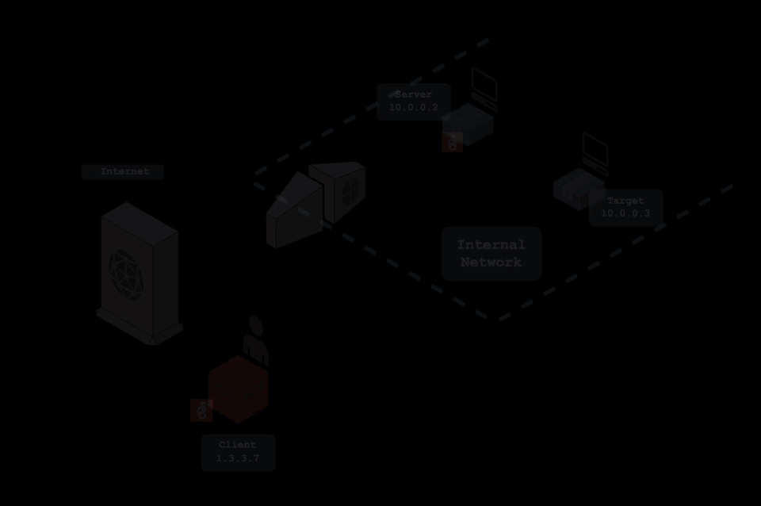
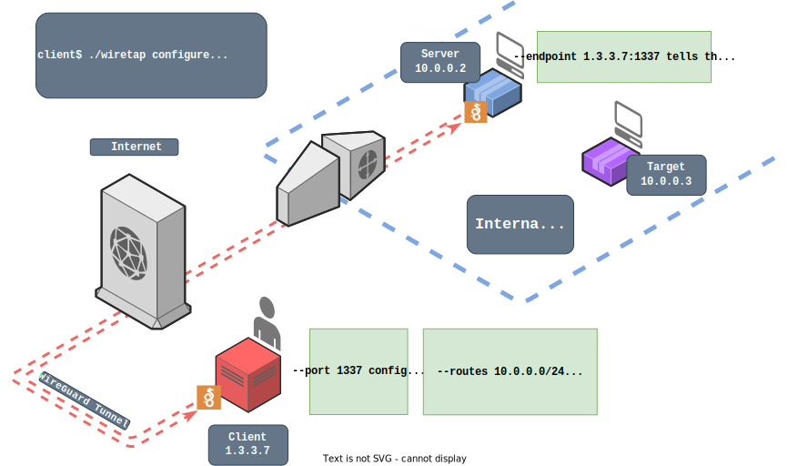

<div align="center">

#  Wiretap

Wiretap is a transparent, VPN-like proxy server that tunnels traffic via WireGuard and requires no special privileges to run.
</div>

In this diagram, the client has generated and installed a WireGuard configuration file that will route traffic destined for `10.0.0.0/24` through a WireGuard interface. Wiretap is then deployed to the server with a configuration that connects to the client as a WireGuard peer. The client can then interact with resources local to the server as if on the same network. 

<div align="center">


</div>

## Quick Start

1. Download binaries from the [releases](https://github.com/sandialabs/wiretap/releases) page, one for your client machine and one for your server (if different os/arch)
2. Run `./wiretap configure --port <port> --endpoint <socket> --routes <routes>` with the appropriate arguments
3. Import the resulting `wiretap.conf` file into WireGuard on the client machine
4. Copy and paste the arguments output from the configure command into Wiretap on the server machine

## Requirements

### Client System

* WireGuard - https://www.wireguard.com/install/
* Privileged access to configure WireGuard

### Server System

* UDP access to client system's WireGuard endpoint (i.e., UDP traffic can be sent out and come back on at least one port)

While not ideal, Wiretap can still work with outbound TCP instead of UDP. See the [TCP Tunneling](#tcp-tunneling) section for a step-by-step guide. 

## Installation

Grab a binary from the [releases](https://github.com/sandialabs/wiretap/releases) page. You may want two binaries if the OS/ARCH are different on the client and server machines.

If you want to compile it yourself or can't find the OS/ARCH you're looking for, install Go (>=1.19) from https://go.dev/dl/ and use the provided [Makefile](./src/Makefile).

## Usage

### Configure

<div align="center">


</div>

On the client machine, run Wiretap in configure mode to build a config

```bash
./wiretap configure --port <port> --endpoint <socket> --routes <routes>
```

Following the example in the diagram:
```bash
./wiretap configure --port 1337 --endpoint 1.3.3.7:1337 --routes 10.0.0.0/24
```
```

Configuration successfully generated.
Import the config into WireGuard locally and pass the arguments below to Wiretap on the remote machine.

config: wiretap.conf
────────────────────────────────
[Interface]
PrivateKey = qCvx4DBXqemoO8B7eRI2H9Em8zJn++rIBKO+F+ufQWE=
Address = 192.168.0.2/32
Address = fd::2/128
ListenPort = 1337

[Peer]
PublicKey = 6NxBlwJHujEFr5n9qvFAUyinj0l7Wadd/ZDQMCqTJAA=
AllowedIPs = 10.0.0.0/24,a::/128
────────────────────────────────

args: serve --private qGrU0juci5PLJ1ydSufE/UwlErL/bqfcz6uWil705UU= --public ZhRIAcGVwT7l9dhEXv7cvYKwLxOZJR4bgU4zePZaT04= --endpoint 1.3.3.7:1337

```

Install the resulting config either by copying and pasting the output or by importing the new `wiretap.conf` file into WireGuard:

* If using a GUI, select the menu option similar to *Import Tunnel(s) From File*
* If you have `wg-quick` installed, `sudo wg-quick up ./wiretap.conf`

Don't forget to disable or remove the tunnel when you're done (e.g., `sudo wg-quick down ./wiretap.conf`)

### Deploy

On the remote machine, upload the binary and then copy the command with the private and public keys to start Wiretap in server mode:
```
.\wiretap.exe serve --private qGrU0juci5PLJ1ydSufE/UwlErL/bqfcz6uWil705UU= --public ZhRIAcGVwT7l9dhEXv7cvYKwLxOZJR4bgU4zePZaT04= --endpoint 1.3.3.7:1337
```

Confirm that the client and server have successfully completed the handshake. The client should see a successful handshake in whatever WireGuard interface is running. If using the command-line tools, check with `wg show`.

### Add Peers (optional)

You can create new configurations after deployment for sharing access to the target network with others.

To test access to the Wiretap API running on the server, run:

```bash
./wiretap ping
```
```
response: pong
  from: a::
  time: 2.685600 milliseconds
```

A successful `pong` message indicates that the API is responsive and commands like `add` will now work.

Adding a peer is very similar to configuring Wiretap initially. It will generate a configuration file you can share, but it will not output arguments that need to be passed to the server because that information is passed via the API. If you're generating a configuration for someone else, get their address information for the endpoint and port flags.

```bash
./wiretap add --port 1337 --endpoint 1.3.3.8:1337 --routes 10.0.0.0/24
```
```

Configuration successfully generated and pushed to server.
Import this config locally or send it to a friend.

config: wiretap_1.conf
────────────────────────────────
[Interface]
PrivateKey = UJsLCSTg6xqfrKJtXQioaek/mCj4gzOdUIrp/+NkJ3Q=
Address = 192.168.0.3/32
Address = fd::3/128
ListenPort = 1337

[Peer]
PublicKey = 7mVguCBt7qxMsjDHR7WzzzNXbyBi5Q35gMvyUxjWMWc=
AllowedIPs = 10.0.0.0/24,a::/128
────────────────────────────────

```

At this point, the server will attempt to reach out to the provided endpoint. Share the config file and have the recipient import it into WireGuard for Wiretap to connect.

> **Note**
> To add another peer on the same machine, you will need to specify an unused port, unused routes, and disable the API route.

## Help

```bash
./wiretap --help --show-hidden
```
```
Usage:
  wiretap [flags]
  wiretap [command]

Available Commands:
  add         Add peer to wiretap
  configure   Build wireguard config
  help        Help about any command
  ping        Ping wiretap server API
  serve       Listen and proxy traffic into target network

Flags:
  -h, --help          help for wiretap
      --show-hidden   show hidden flag options
  -v, --version       version for wiretap

Use "wiretap [command] --help" for more information about a command.
```

## Features

* Network
    - IPv4
    - IPv6
    - ICMPv4: Echo requests and replies
    - ICMPv6: Echo requests and replies
* Transport
    - TCP
        - Transparent connections
        - RST response when port is unreachable
    - UDP
        - Transparent "connections"
        - ICMP Destination Unreachable when port is unreachable
* API
    - API internal to Wiretap for dynamic configuration
    - Add peers after deployment for multi-user support

## Demo

The demo has three hosts and two networks:

```
┌──────────┐
│ client   │
│          │
│ 10.1.0.2 │
│ fd:1::2  ├┬───────────────────────┐
├──────────┼│ exposed network       │
├──────────┼│ 10.1.0.0/16,fd:1::/64 │
│ 10.1.0.3 ├┴───────────────────────┘
│ fd:1::3  │
│          │
│ server   │
│          │
│ 10.2.0.3 │
│ fd:2::3  ├┬───────────────────────┐
├──────────┼│ target network        │
├──────────┼│ 10.2.0.0/16,fd:2::/64 │
│ 10.2.0.4 ├┴───────────────────────┘
│ fd:2::4  │
│          │
│ target   │
└──────────┘
```

### Video

<div align="center">


https://user-images.githubusercontent.com/26662746/202822223-af752660-f263-43dc-bdf1-63140bab316b.mp4
</div>

### Step-By-Step

You have unprivileged access to the server host and want to reach the target host from the client host using Wiretap. 

#### Setup

Clone this repo.

Start the demo containers with:
```bash
docker compose up --build
```

Open new tabs for interactive sessions with the client and server machines:
```bash
docker exec -it wiretap-client-1 bash
```
```bash
docker exec -it wiretap-server-1 bash
```

#### Observe Network Limitations

The target network, and therefore the target host, is unreachable from the client machine. Both the server and target hosts are running a web service on port 80, so try interacting with each of the services from each of the hosts:

Accessing the server's web service from the client should work:
```bash
client$ curl http://10.1.0.3
```

Accessing the target web service from the client should not work, but doing the same thing from the server machine will:

```bash
# fails
client$ curl http://10.2.0.4
```
```bash
server$ curl http://10.2.0.4
```

#### Configure

Configure Wiretap from the client machine. Remember, `--endpoint` is how the server machine should reach the client and `--routes` determines which traffic is routed through Wiretap. 

* `--endpoint` needs to be the client address and the default WireGuard port: `10.1.0.2:51820`
* `--routes` needs to be the subnet of the target network: `10.2.0.0/16`. But there is also an IPv6 subnet, so we should also put `fd:2::/64`. If you just wanted to route traffic to the target host, you could put `10.2.0.4/32` here instead

```bash
./wiretap_linux_amd64 configure --endpoint 10.1.0.2:51820 --routes 10.2.0.0/16,fd:2::/64
```

Install the newly created WireGuard config with:

```bash
wg-quick up ./wiretap.conf
```

Copy and paste the Wiretap arguments printed by the configure command into the server machine prompt. It should look like this:

```bash
./wiretap_linux_amd64 serve --private <key> --public <key> --endpoint 10.1.0.2:51820
```

#### Test

The WireGuard handshake should be complete. Confirm with:

```bash
wg show
```

If the handshake was successful the client should be able to reach the target network transparently. Confirm by running the same test that failed before:

```bash
client$ curl http://10.2.0.4
```

That's it! Try scanning, pinging, and anything else you can think of (please submit an issue if you think something should work but doesn't!). Here are a few ideas:
- HTTP
    - `curl http://10.2.0.4`
    - `curl http://[fd:2::4]`
- Nmap
    - `nmap 10.2.0.4 -v`
    - `nmap -6 fd:2::4 -v`
- ICMP
    - `ping 10.2.0.4`
    - `ping fd:2::4`
- UDP
    - `nmap -sU 10.2.0.4 -v`
    - `nmap -sU -6 fd:2::4 -v`

#### Teardown

To bring down the WireGuard interface on the client machine, run:

```bash
wg-quick down ./wiretap.conf
```

## How It Works

A traditional VPN can't be installed by unprivileged users because VPNs rely on dangerous operations like changing network routes and working with raw packets. 

Wiretap bypasses this requirement by rerouting traffic to a user-space TCP/IP network stack, where a listener accepts connections on behalf of the true destination. Then it creates a new connection to the true destination and copies data between the endpoint and the peer. This is similar to how https://github.com/sshuttle/sshuttle works, but relies on WireGuard as the tunneling mechanism rather than SSH. 


## Experimental

### TCP Tunneling

> **Note**
> Performance will suffer, only use TCP Tunneling as a last resort

If you have *no* outbound UDP access, you can still use Wiretap, but you'll need to tunnel WireGuard traffic through TCP. This should only be used as a last resort. From WireGuard's [Known Limitations](https://www.wireguard.com/known-limitations/) page:
> **TCP Mode**
>
> WireGuard explicitly does not support tunneling over TCP, due to the classically terrible network performance of tunneling TCP-over-TCP. Rather, transforming WireGuard's UDP packets into TCP is the job of an upper layer of obfuscation (see previous point), and can be accomplished by projects like [udptunnel](https://github.com/rfc1036/udptunnel) and [udp2raw](https://github.com/wangyu-/udp2raw-tunnel).

Another great tool that has similar cross-platform capabilities to Wiretap is [Chisel](https://github.com/jpillora/chisel). We can use chisel to forward a UDP port to the remote system over TCP. To use:

Run chisel server on the client system, specifying a TCP port you can reach from the server system:
```bash
./chisel server --port 8080
```

On the server system, forward the port with this command using the same TCP port you specified in the previous command and using the ListenPort you specified when configuring Wiretap (the default is 51820). The format is `<localport>:0.0.0.0:<remoteport>/udp`.

In this example, we're forwarding 51821/udp on the server to 51820 on the client:
```bash
./chisel client <endpoint address>:8080 51821:0.0.0.0:51820/udp
```

Finally, run Wiretap with the forwarded local port as your endpoint on the server system:
```bash
./wiretap serve --private <key> --public <key> --endpoint localhost:51821
```

### Nested Tunnels

It is possible to nest multiple WireGuard tunnels using Wiretap, allowing for multiple hops without requiring root on any of the intermediate nodes.

Using this network as an example, we can deploy Wiretap to both hop 1 and hop 2 machines in order to access the target machine on network 3.
```
                ┌──────────────────────────────────┐
┌───────────────┼───────────────┐  ┌───────────────┼────────────────┐
│ ┌──────────┐  │  ┌──────────┐ │  │  ┌──────────┐ │   ┌──────────┐ │
│ │          │  │  │          │ │  │  │          │ │   │          │ │
│ │ client   ├──┼─►│ hop 1    ├─┼──┼─►│ hop 2    ├─┼──►│ target   │ │
│ │          │  │  │          │ │  │  │          │ │   │          │ │
│ └──────────┘  │  └──────────┘ │  │  └──────────┘ │   └──────────┘ │
└───────────────┼───────────────┘  └───────────────┼────────────────┘
 network 1:     └──────────────────────────────────┘     network 3:
 10.0.1.0/24                  network 2:                 10.0.3.0/24
                              10.0.2.0/24
```

After deploying Wiretap to hop 1 normally, re-run the configure command but forgo the endpoint argument because Wiretap currently has no way of tunneling traffic *back* to the client machine if initiated from the server side of the network. In the future Wiretap may support routing between multiple instances of Wiretap.

> **Note**
> Make sure the routes and port are different from the initial configuration

```bash
./wiretap configure --port 51821 --routes 10.0.3.0/24
```

Then deploy Wiretap to hop 2 with the resulting arguments. Because no endpoint was provided, the Endpoint parameter needs to be provided manually to the config file. This depends on the client being able to access hop 2 *through the first hop's instance of Wiretap*! Add the endpoint to the peer section of the new Wiretap config:

```
Endpoint = 10.0.2.2:51820
```

Finally, import the config into WireGuard on the client system. The client system will handshake with Wiretap on hop 2 via the tunnel to hop 1, and then all future connections to 10.0.3.0/24 will be routed to network 3 through both hops. 
