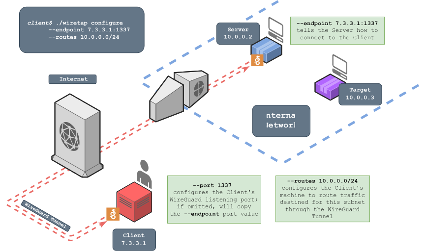
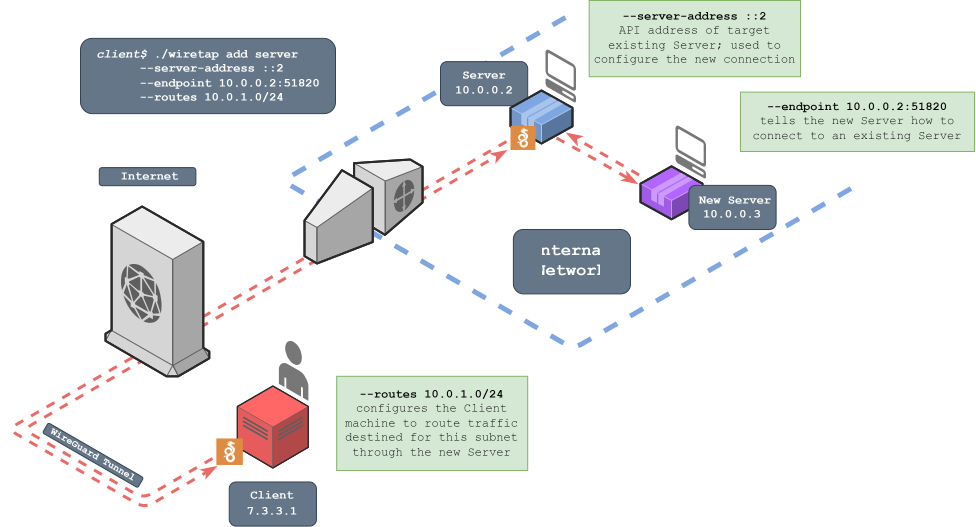

<div align="center">

#  Wiretap

Wiretap is a transparent, VPN-like proxy server that tunnels traffic via WireGuard and requires no special privileges to run.
</div>

In this diagram, the Client has generated and installed WireGuard configuration files that will route traffic destined for `10.0.0.0/24` through a WireGuard interface. Wiretap is then deployed to the Server with a configuration that connects to the Client as a WireGuard peer. The Client can then interact with local network resources as if on the same network as the Server, and optionally chain additional Servers to reach new networks. Access to the Wiretap network can also be shared with other Clients.

<div align="center">


[(Static Version)](media/Wiretap_Static.svg?raw=true)
</div>

# Table of Contents
- [Terminology and Requirements](#terminology-and-requirements)
	- [Client System Requirements](#client-system-requirements)
	- [Server System Requirements](#server-system-requirements)
	- [Environment Requirements](#environment-requirements)
- [Quick Start](#quick-start)
- [Installation](#installation)
- [How it Works](#how-it-works)
- [Usage](#usage)
	- [Configure](#configure)
		- [Outbound Connections](#outbound-connections)
		- [Simple Mode](#simple-mode)
	- [Serve](#serve)
  - [Status](#status)
	- [Add Server (Optional)](#add-server-optional)
	- [Add Client (Optional)](#add-client-optional)
	- [Expose (Port Forwarding)](#expose-port-forwarding)
		- [List](#list)
		- [Remove](#remove)
- [Features](#features)
- [Demo](#demo)
- [Experimental](#experimental)
	- [Localhost Server Access](#localhost-server-access)
	- [TCP Tunneling](#tcp-tunneling)
	- [Add Clients To Any Server](#add-clients-to-any-server)


# Terminology and Requirements

A **Wiretap Server** is any machine where a Wiretap binary is running the `serve` command. Servers receive and relay network traffic on behalf of Wiretap Clients, acting like a VPN "exit node."

A **Wiretap Client** is any machine running the [Wireguard](https://www.wireguard.com/) configurations necessary to send and receive network traffic through a Wiretap Server. It functions much like a client in a VPN connection. Clients are also able to reconfigure parts of the Wiretap network dynamically using the Wiretap binary.

> [!IMPORTANT]
> Unlike the typical use of "client" and "server" terms in networking, Wiretap's Client and Server terms have nothing to do with which machine listens for or initiates the initial connection.

## Client System Requirements

* WireGuard installed - https://www.wireguard.com/install/
* Privileged access necessary to configure WireGuard interfaces (usually root/admin access)


## Server System Requirements

* Ability to get the Wiretap binary onto the Server system, and run it


## Environment Requirements

* Bidirectional UDP communication between Server and Client on one port. Any firewalls between them must allow at least one machine to initiate a UDP connection to the other.
    * The machine receiving the initial connection (the Client by default) must be able to listen for UDP connections on a port that the initiating machine can connect to.

> [!NOTE]
> By default the Server initiates the handshake to the Client because the Server is more likely to have outbound UDP allowed through a firewall than inbound UDP, but the reverse is easily configurable.

While not ideal, Wiretap can work with TCP instead of UDP. See the experimental [TCP Tunneling](#tcp-tunneling) section for more info.

# Quick Start

1. Download binaries from the [releases](https://github.com/sandialabs/wiretap/releases) page, one for your Client machine and one for your Server machine (if different os/arch). Copy the Wiretap binary onto the server
2. On the Client, run `./wiretap configure --endpoint <IP>:<port> --routes <CIDRs>` with the [appropriate arguments](#Configure)
3. Copy the server command output that best suits the Server OS and run it on the Server machine
4. On the Client, run `sudo wg-quick up ./wiretap_relay.conf && sudo wg-quick up ./wiretap.conf` create the associated Wireguard interfaces
5. Confirm the handshake completed for both configs by running `sudo wg show` on the Client
6. (Optional) Add more servers and clients as needed with the `wiretap add` command

See the [Usage section](#Usage) for more details.

# Installation

No installation of Wiretap is required. Just grab a binary from the [releases](https://github.com/sandialabs/wiretap/releases) page. You may need two different binaries if the OS/ARCH are different on the client and server machines.

If you want to compile it yourself or can't find the OS/ARCH you're looking for, install Go (>=1.23.3) from https://go.dev/dl/ and use the provided [Makefile](./src/Makefile).

# How it Works

> [!TIP]
> For a more detailed explanation of Wiretap's networking model, see the [How it Works page in the Wiki](https://github.com/sandialabs/wiretap/wiki/How-it-Works). That information can be very helpful when trying to troubleshoot connection issues.

Traditional VPN server software can't be installed by unprivileged users because VPNs rely on dangerous operations like changing network routes and working with raw packets.

Wiretap bypasses this requirement by rerouting traffic to a user-space TCP/IP network stack, where a listener accepts connections on behalf of the true destination. Then it creates a new connection to the true destination (via the native network stack) and copies data between the connections, effectively connecting the Client to the destination. This is similar to how https://github.com/sshuttle/sshuttle and https://github.com/nicocha30/ligolo-ng work, but relies on WireGuard as the tunneling mechanism rather than SSH or TLS.

To build secure and scalable tunnels across multiple hops, each node in the Wiretap network has two interfaces: Relay and E2EE (End-to-End Encrypted). The Relay interfaces simply *relay* packets between nodes, but cannot see the plaintext. When a Relay node sees a packet that does not match routing rules, it forwards it to its own E2EE interface where the contents can be decrypted by only that interface. This means there are two layers of WireGuard encapsulation (encryption) between any two nodes.

<div align="center">


(Click image to view enlarged version)
</div>

# Usage

```bash
./wiretap --help --show-hidden
```
```
Usage:
  wiretap [flags]
  wiretap [command]

Available Commands:
  add         Add peer to wiretap
  configure   Build wireguard config
  expose      Expose local services to servers
  help        Help about any command
  ping        Ping wiretap server API
  serve       Listen and proxy traffic into target network
  status      Show peer layout

Flags:
  -h, --help          help for wiretap
  -H, --show-hidden   show hidden flag options
  -v, --version       version for wiretap

Use "wiretap [command] --help" for more information about a command.
```

The following commands are documented in this section:
* [configure](#Configure)
* [serve](#Serve)
* [status](#Status)
* [add server](#Add-Server-Optional)
* [add client](#Add-Client-Optional)
* [expose](#Expose-Port-Forwarding)

Get help for any command by adding the `-h` flag to it.

> [!TIP]
> Some deprecated and less-common flags are hidden from the standard help output. Add the `-H` flag as well to see them.

## Configure

<div align="center">


</div>

On the Client machine, run Wiretap's `configure` command to generate starting config files:

```bash
./wiretap configure --endpoint <IP>:<port> --routes <CIDRs>
```

* `--endpoint` tells the Server machine how to connect to the Client machine's Relay interface (the E2EE interfaces already know how to talk to each other if the Relay interfaces are working)
* `--routes` is the equivalent of WireGuard's `AllowedIPs` setting. This tells the Client to route traffic that matches these IP ranges through Wiretap.

> [!IMPORTANT]
> By default the listening port will be configured to be the same as the port specified in the `--endpoint IP:port`. This can be overwritten using the `--port` argument.
> If creating an outbound connection, by default the listening port will be configured to be the same as the port specified in the `--outbound-endpoint IP:port`. This can be overwritten using the `--sport` argument.

Following the example in the diagram:
```bash
./wiretap configure --endpoint 7.3.3.1:1337 --routes 10.0.0.0/24
```

---

<details>

<summary>Click to view output</summary>

```
Configurations successfully generated.
Import the two configs into WireGuard locally and pass the arguments below to Wiretap on the remote machine.

config: wiretap_relay.conf
────────────────────────────────
[Interface]
PrivateKey = cGsJkcVIajZW7kfN5SMwijmMx59ke7FZ+qdZOcsNDE0=
Address = 172.16.0.1/32
Address = fd:16::1/128
ListenPort = 1337

[Peer]
PublicKey = kMj7HwfYYFO/XEHNFK2kz9cBd7vTHk63fhygyuYLMzI=
AllowedIPs = 172.17.0.0/24,fd:17::/48
────────────────────────────────

config: wiretap.conf
────────────────────────────────
[Interface]
PrivateKey = YCTRVwB4xOEcBtifVmhjMhRYL7+DOlDP5VdHZGclZGg=
Address = 172.19.0.1/32
Address = fd:19::1/128
ListenPort = 51821
MTU = 1340

[Peer]
PublicKey = 3ipWthpJzqVo5wcb1TSDS1M8YOiBQYBPmbj3mVD/5Fg=
AllowedIPs = 10.0.0.0/24,::2/128
Endpoint = 172.17.0.2:51821
────────────────────────────────

server config: wiretap_server.conf

server command:
POSIX Shell:  WIRETAP_RELAY_INTERFACE_PRIVATEKEY=WDH8F6rSUZDyQFfEsRjWLCnapU254qrSAfpGyGs+N1Y= WIRETAP_RELAY_INTERFACE_PORT=51820 WIRETAP_RELAY_PEER_PUBLICKEY=Ta75SvIb2v2V8EDo6oE2Fvsys/CNlkzW+aPjxdY+Dlc= WIRETAP_RELAY_PEER_ENDPOINT=7.3.3.1:1337 WIRETAP_E2EE_INTERFACE_PRIVATEKEY=GKzGBe3qS7JuLp0vMAErBW6lAewvmFowCIbcgwzComg= WIRETAP_E2EE_PEER_PUBLICKEY=cXddDGWCzd5igux4FDv97XBsyLH0SRPehhTz3E2IXBM= WIRETAP_E2EE_PEER_ENDPOINT=172.16.0.1:51821 ./wiretap serve
 PowerShell:  $env:WIRETAP_RELAY_INTERFACE_PRIVATEKEY="WDH8F6rSUZDyQFfEsRjWLCnapU254qrSAfpGyGs+N1Y="; $env:WIRETAP_RELAY_INTERFACE_PORT="51820"; $env:WIRETAP_RELAY_PEER_PUBLICKEY="Ta75SvIb2v2V8EDo6oE2Fvsys/CNlkzW+aPjxdY+Dlc="; $env:WIRETAP_RELAY_PEER_ENDPOINT="7.3.3.1:1337"; $env:WIRETAP_E2EE_INTERFACE_PRIVATEKEY="GKzGBe3qS7JuLp0vMAErBW6lAewvmFowCIbcgwzComg="; $env:WIRETAP_E2EE_PEER_PUBLICKEY="cXddDGWCzd5igux4FDv97XBsyLH0SRPehhTz3E2IXBM="; $env:WIRETAP_E2EE_PEER_ENDPOINT="172.16.0.1:51821"; .\wiretap.exe serve
Config File:  ./wiretap serve -f wiretap_server.conf
```
</details>

---

> [!NOTE]
> The 51821 ListenPort in `wiretap.conf` needs to be available for use on the Client, but does NOT need to be accessible to the Server over real-world networks. See the [How It Works](#how-it-works) section for details. Use `--simple` in the `configure` command if your setup requires a single interface on the Client. The Server will auto-detect that configuration. 

Install the resulting `wiretap_relay.conf` and `wiretap.conf` configs files into WireGuard on the Client:

* If you have `wg-quick` installed, run `sudo wg-quick up ./wiretap_relay.conf && sudo wg-quick up ./wiretap.conf`
* If using a GUI, select the menu option similar to *Import Tunnel(s) From File*

> [!TIP]
> You can modify the AllowedIPs in the `wiretap.conf` file any time after generating the config files, just reload the config file with `wg-quick down ./wiretap.conf && wg-quick up ./wiretap.conf` (or re-import them into the GUI) after making the change. No changes are needed on the Server to update them.

Don't forget to disable or remove the tunnels when you're done (e.g., `sudo wg-quick down ./wiretap.conf && sudo wg-quick down ./wiretap_relay.conf`)

### Outbound Connections
You can use the `--outbound-endpoint` flag to configure the Client to Initiate the UDP connection to the Server. If you do, the `--outbound-endpoint` value will instead be used to tell the Client where to connect to the Server, and the `--sport` value (explicit or implicit) will configure the Server's listening port.

In this case the Client will listen on 51820 in case other Servers need to be added using the default Inbound mode, but this can be changed by passing a value to the `--port` flag when running the `configure` command.

### Simple Mode
While not recommended, you can add the `--simple` flag to configure Wiretap as a more traditional one-Client-and-one-Server VPN. Most of Wiretap's dynamic configuration features (any Wiretap commands you would run after establishing the initial connection) will be unavailable in this mode.

## Serve

On the remote machine, upload the Wiretap binary and then run one of the commands from the output of `configure` to start Wiretap in Server mode:
```powershell
$env:WIRETAP_RELAY_INTERFACE_PRIVATEKEY="WDH8F6rSUZDyQFfEsRjWLCnapU254qrSAfpGyGs+N1Y="; $env:WIRETAP_RELAY_INTERFACE_PORT="51820"; $env:WIRETAP_RELAY_PEER_PUBLICKEY="Ta75SvIb2v2V8EDo6oE2Fvsys/CNlkzW+aPjxdY+Dlc="; $env:WIRETAP_RELAY_PEER_ENDPOINT="1.3.3.7:1337"; $env:WIRETAP_E2EE_INTERFACE_PRIVATEKEY="GKzGBe3qS7JuLp0vMAErBW6lAewvmFowCIbcgwzComg="; $env:WIRETAP_E2EE_PEER_PUBLICKEY="cXddDGWCzd5igux4FDv97XBsyLH0SRPehhTz3E2IXBM="; $env:WIRETAP_E2EE_PEER_ENDPOINT="172.16.0.1:51821"; .\wiretap.exe serve
```

There are two other ways to pass arguments to the Server:
1. With the generated Server config file: `-f wiretap_server.conf`
2. The legacy method of passing command line arguments (`--endpoint 7.3.3.1:1337 ...`). Be aware that this method exposes the arguments to other users on the system. A compromised private key can be used to connect to the Client as a peer and/or decrypt traffic

> [!NOTE]
> The wiretap_server.conf file uses a notation unique to Wiretap. It cannot be used to start a server with `wg-quick` or other generic Wireguard tools.

Confirm that the Relay interfaces on the Client and Server have successfully completed a handshake. The Client should see successful handshakes in whatever WireGuard interface is running. If using the command-line tools, check with `sudo wg show`. By default the E2EE handshake will not occur until the Client sends data, so you may need to attempt to use the connection (e.g. `ping` an IP in the associated `--routes`) to trigger the handshake process.

Now the Client should be able to interact with the `routes` specified in the `configure` command!

## Status

Once the client configs have been imported and Wireguard is started, you can view the state of the network and see Server API addresses with `./wiretap status`.

```bash
./wiretap status
```
```
╭────────────────────────╮
│ Wiretap Network Status │
╰────────────┬───────────╯
             │
  ╭──────────┴──────────╮
  │client               │
  │                     │
  │  relay: Ta75SvIb... │
  │   e2ee: cXddDGWC... │
  │                     │
  ╰──────────┬──────────╯
             │
  ╭──────────┴──────────╮
  │server               │
  │  relay: kMj7HwfY... │
  │   e2ee: 3ipWthpJ... │
  │                     │
  │    api: ::2         │
  │ routes: 10.0.0.0/24 │
  ╰─────────────────────╯
```

> [!TIP]
> Add the `--network-info` flag to this command to get a list of each Server host's network interfaces and associated CIDR addresses. 

## Add Server (Optional)

<div align="center">


</div>

The `add server` command is meant to extend the Wiretap network to reach new areas of a target network. At least one Client and Server must be configured and successfully deployed (i.e., with `configure`) before adding another Server. Servers can attach to any other Server *or* the Client itself.

> [!WARNING]
> Due to the way new Clients are added to existing networks, all Servers must be deployed *before* adding additional Clients. Added Clients won't be able to access Servers deployed after they were added. Additionally, if a Wiretap Server process exits or dies for any reason it will not remember any added Clients when you restart it.

If you want to attach a new Server to an existing Server (rather than the Client) you must also specify the existing Server's API address in your `add server` command using the `--server-address` argument; this API address **must** reference the same existing Server that the new Server will connect to via the `--endpoint` IP:port or else the new connection will fail. You can view Server API addresses using the `status` command.

In this example, we will connect to the server that has API address `::2`, which is listening on `10.0.0.2:51820`:

```bash
./wiretap add server --server-address ::2 --endpoint 10.0.0.2:51820 --routes 10.0.1.0/24
```


---

<details>

<summary>Click to view output</summary>

```
Configurations successfully generated.
Import the updated config(s) into WireGuard locally and pass the arguments below to Wiretap on the new remote server.

config: wiretap.conf
────────────────────────────────
[Interface]
PrivateKey = YCTRVwB4xOEcBtifVmhjMhRYL7+DOlDP5VdHZGclZGg=
Address = 172.19.0.1/32
Address = fd:19::1/128
ListenPort = 51821
MTU = 1340

[Peer]
PublicKey = 3ipWthpJzqVo5wcb1TSDS1M8YOiBQYBPmbj3mVD/5Fg=
AllowedIPs = 10.0.0.0/24,::2/128
Endpoint = 172.17.0.2:51821

[Peer]
PublicKey = YOVI9nOvjOWTre0OVzrjx8qsYRgyuSLWndv28S2udiQ=
AllowedIPs = 10.0.1.0/24,::3/128
Endpoint = 172.17.0.3:51821
────────────────────────────────

server config: wiretap_server_1.conf

POSIX Shell:  WIRETAP_RELAY_INTERFACE_PRIVATEKEY=sLERnxT2+VdwwcJOTUHK5fa5sIN7oJ1Jww9n42txrEQ= WIRETAP_RELAY_INTERFACE_PORT=51820 WIRETAP_RELAY_INTERFACE_IPV4=172.17.0.3 WIRETAP_RELAY_INTERFACE_IPV6=fd:17::3 WIRETAP_RELAY_PEER_PUBLICKEY=kMj7HwfYYFO/XEHNFK2kz9cBd7vTHk63fhygyuYLMzI= WIRETAP_RELAY_PEER_ALLOWED=172.16.0.0/16,fd:16::/40 WIRETAP_RELAY_PEER_ENDPOINT=10.0.0.2:51820 WIRETAP_E2EE_INTERFACE_PRIVATEKEY=uF79x5X8q3Vd/ajWMR5XyDt/haahtpy5PkJj9b+OaUE= WIRETAP_E2EE_INTERFACE_API=::3 WIRETAP_E2EE_PEER_PUBLICKEY=cXddDGWCzd5igux4FDv97XBsyLH0SRPehhTz3E2IXBM= WIRETAP_E2EE_PEER_ENDPOINT=172.16.0.1:51821 ./wiretap serve
 PowerShell:  $env:WIRETAP_RELAY_INTERFACE_PRIVATEKEY="sLERnxT2+VdwwcJOTUHK5fa5sIN7oJ1Jww9n42txrEQ="; $env:WIRETAP_RELAY_INTERFACE_PORT="51820"; $env:WIRETAP_RELAY_INTERFACE_IPV4="172.17.0.3"; $env:WIRETAP_RELAY_INTERFACE_IPV6="fd:17::3"; $env:WIRETAP_RELAY_PEER_PUBLICKEY="kMj7HwfYYFO/XEHNFK2kz9cBd7vTHk63fhygyuYLMzI="; $env:WIRETAP_RELAY_PEER_ALLOWED="172.16.0.0/16,fd:16::/40"; $env:WIRETAP_RELAY_PEER_ENDPOINT="10.0.0.2:51820"; $env:WIRETAP_E2EE_INTERFACE_PRIVATEKEY="uF79x5X8q3Vd/ajWMR5XyDt/haahtpy5PkJj9b+OaUE="; $env:WIRETAP_E2EE_INTERFACE_API="::3"; $env:WIRETAP_E2EE_PEER_PUBLICKEY="cXddDGWCzd5igux4FDv97XBsyLH0SRPehhTz3E2IXBM="; $env:WIRETAP_E2EE_PEER_ENDPOINT="172.16.0.1:51821"; .\wiretap.exe serve
Config File:  ./wiretap serve -f wiretap_server_1.conf
```

</details>

---

This command will modify the Client's E2EE configuration (`wiretap.conf`) to allow communication with the new Server, so you need to re-import it. For example, `sudo wg-quick down ./wiretap.conf && sudo wg-quick up ./wiretap.conf`. If you are attaching a new Server directly to the Client, the Relay config will also need to be refreshed in the same way.

Now you can use any of the `serve` command options to start Wiretap on the new Server, just like you did after running the `configure` command. It will then join the Wiretap network by connecting to the existing Server.

At this point the new routes should be usable! You can confirm that everything looks correct with `wiretap status`:

```bash
./wiretap status
```
```
╭────────────────────────╮
│ Wiretap Network Status │
╰────────────┬───────────╯
             │
  ╭──────────┴──────────╮
  │client               │
  │                     │
  │  relay: Ta75SvIb... │
  │   e2ee: cXddDGWC... │
  │                     │
  ╰──────────┬──────────╯
             │
  ╭──────────┴──────────╮
  │server               │
  │  relay: kMj7HwfY... │
  │   e2ee: 3ipWthpJ... │
  │                     │
  │    api: ::2         │
  │ routes: 10.0.0.0/24 │
  ╰──────────┬──────────╯
             │
  ╭──────────┴──────────╮
  │server               │
  │  relay: GMkUzfDy... │
  │   e2ee: YOVI9nOv... │
  │                     │
  │    api: ::3         │
  │ routes: 10.0.1.0/24 │
  ╰─────────────────────╯
```

Now the Client can reach `10.0.0.0/24` and `10.0.1.0/24`. From here you can attach more Servers to any of the three existing nodes.

## Add Client (Optional)

<div align="center">


</div>

The `add client` command can be used to share access to the Wiretap network with others.

> [!WARNING]
> All servers must be deployed *before* adding additional clients. Additionally, if a Wiretap Server process exits or dies for any reason it will not remember any added Clients when you restart it.

Adding a new Client is very similar to the other commands. It will generate a `wiretapX.conf` and `wiretap_relayX.conf` for sharing, where X is an incrementing number. Make sure that all of the first-hop Servers (any Server directly attached to the original Client) can reach or be reached by the new Client or else the new Client won't have access to that chain of Servers. Once you get the endpoint information from whoever will be running the new Client (the IP and port they will listen on), run:

```bash
./wiretap add client --endpoint 7.3.3.2:1337 --port 1337
```

---

<details>

<summary>Click to view output</summary>

```
Configurations successfully generated.
Have a friend import these files into WireGuard

config: wiretap_relay_1.conf
────────────────────────────────
[Interface]
PrivateKey = UEgzp6zv8lNnpih31RfzKsz+BLyN5qNfh6PbCdF1Cmg=
Address = 172.16.0.2/32
Address = fd:16::2/128
ListenPort = 1337

[Peer]
PublicKey = kMj7HwfYYFO/XEHNFK2kz9cBd7vTHk63fhygyuYLMzI=
AllowedIPs = 172.17.0.0/24,fd:17::/48
────────────────────────────────

config: wiretap_1.conf
────────────────────────────────
[Interface]
PrivateKey = 8AhL1kDjwBn/IoY4KLd5mMP4GQsyMYNsqYm3aM/bHnE=
Address = 172.19.0.2/32
Address = fd:19::2/128
ListenPort = 51821
MTU = 1340

[Peer]
PublicKey = 3ipWthpJzqVo5wcb1TSDS1M8YOiBQYBPmbj3mVD/5Fg=
AllowedIPs = 10.0.0.0/24,::2/128
Endpoint = 172.17.0.2:51821

[Peer]
PublicKey = YOVI9nOvjOWTre0OVzrjx8qsYRgyuSLWndv28S2udiQ=
AllowedIPs = 10.0.1.0/24,::3/128
Endpoint = 172.17.0.3:51821
────────────────────────────────
```

</details>

---

Send these files and have the recipient import them into WireGuard to have access to everything in the Wiretap network! By default the routes (AllowedIPs) are copied over to the new client configs, but can be modified by the recipient as needed.

## Expose (Port Forwarding)

> **Warning**
> Port forwarding exposes ports and services on your local machine to the remote network, use with caution

You can expose a port on the Client to IPs in Wiretap's `routes` list by using the `expose` command. For example, to allow remote systems to access port 80/tcp on your local Client machine, you could run:

```
./wiretap expose --local 80 --remote 8080
```

Now all existing Wiretap Servers will bind listeners on port 8080/tcp and proxy connections from that port to your local Client machine on port 80/tcp. By default this uses IPv6, so make sure any exposed services listening on the Client support IPv6 as well. To configure Wiretap to only use IPv4, use the `configure` command's `--disable-ipv6` option.

> [!WARNING]
> If a Wiretap server process exits or dies for any reason it will not remember ports it was previously exposing. You will need to re-expose any ports you configured with this command.

To dynamically expose all ports on the Client using SOCKS5:

```
./wiretap expose --dynamic --remote 8080
```

All servers will spin up a SOCKS5 server on port 8080 and proxy traffic to your local machine. It and can be used like this:

```
curl -x socks5://<server-ip>:8080 http://<any-ip>:80
```

The destination IP will be rewritten by the Server so you can put any address.

### List

Use `./wiretap expose list` to see all forwarding rules currently configured.

### Remove

Use `./wiretap expose remove` with the same arguments used in `expose` to delete a rule. For example, to remove the SOCKS5 example above:

```
./wiretap expose remove --dynamic --remote 8080
```

# Features

* Network
    - IPv4
    - IPv6
    - ICMPv4: Echo requests and replies
    - ICMPv6: Echo requests and replies
* Transport
    - TCP
        - Transparent connections
        - RST response when port is unreachable
        - Reverse Port Forward
        - Reverse Socks5 Support
    - UDP
        - Transparent "connections"
        - ICMP Destination Unreachable when port is unreachable
        - Reverse Port Forward
* Application
    - API internal to Wiretap for dynamic configuration
    - Chain servers together to tunnel traffic through an arbitrary number of machines
    - Add clients after deployment for multi-user support

# Demo

Please see the [Demo page in the Wiki](https://github.com/sandialabs/wiretap/wiki/Demo) for instructions on setting up the demo Docker environment.

> [!TIP]
> The interactive demo environment is a great way to get your feet wet testing out how Wiretap works. It provides an ideal network environment, ensuring you can focus on learning how to use Wiretap as intended without getting stuck troubleshooting weird network errors that you often encounter in the real world.

# Experimental

## Localhost Server Access

Sometimes you want to access multiple ports on the Server itself that are bound to the localhost/loopback interface instead of an externally-accessible interface. Rather than setting up many individual port forwards to 127.0.0.1, you can use Wiretap's localhost redirection feature. 

When running the `configure` or `add server` commands, you can specify a `--localhost-ip <IPv4 address>` argument. For example:
```bash
./wiretap configure --endpoint 7.3.3.1:1337 --routes 10.0.0.0/24 -i 192.168.137.137
```
Any packets received by this Server through the Wiretap network with this target destination address (`192.168.137.137` in this example) will be re-routed to the Server host's `127.0.0.1` loopback address instead, with replies routed back to the Client appropriately. The specified address will also be added as a route (with a `/32` mask) to the Client config file to ensure traffic generated with this destination is routed through the Wiretap network. 

For example, with this configuration loaded, you can now easily access a webserver listening on `127.0.0.1:8080` on the Server host like this:
```bash
curl 192.168.137.137:8080
```

> [!CAUTION]
> It is **strongly** recommended that you specify a [private](https://www.arin.net/reference/research/statistics/address_filters/) (not publicly routable) IP address to use for this option, preferably one that you know is not in use in the target network. This feature has only been lightly tested, so if the redirection fails unexpectedly you want to ensure your traffic will go to a "safe" destination. For similar reasons you should not specify a broadcast address, or IPs that your Client already has routes for. 

Under the hood, this feature is roughly equivalent to adding this `iptables` rule to Wiretap's userspace networking stack on the Server:
```
iptables -t nat -A PREROUTING -p tcp -d <IPv4 address> -j DNAT --to-destination 127.0.0.1
```

Limitations:
- Currently this only works for TCP connections, and only for an IPv4 target address. 
	- Unfortunately there's [not a clean way](https://serverfault.com/a/975890) to do NAT to the IPv6 `::1` loopback address, so this feature can't be used to access services listening exclusively on that IPv6 address. 
- This feature does not provide access to other IPs in the 127.0.0.0/8 space. 
- Added Clients currently won't have the redirection IPs automatically added to their routes. 


## TCP Tunneling

> [!WARNING]
> Performance will suffer, only use TCP Tunneling as a last resort

If you have *no* outbound or inbound UDP access, you can still use Wiretap, but you'll need to tunnel WireGuard traffic through TCP. This should only be used as a last resort. From WireGuard's [Known Limitations](https://www.wireguard.com/known-limitations/) page:
> **TCP Mode**
>
> WireGuard explicitly does not support tunneling over TCP, due to the classically terrible network performance of tunneling TCP-over-TCP. Rather, transforming WireGuard's UDP packets into TCP is the job of an upper layer of obfuscation (see previous point), and can be accomplished by projects like [udptunnel](https://github.com/rfc1036/udptunnel) and [udp2raw](https://github.com/wangyu-/udp2raw-tunnel).

Another great tool that has similar cross-platform capabilities to Wiretap is [Chisel](https://github.com/jpillora/chisel). We can use chisel to forward a UDP port to the remote system over TCP. To use:

Run `chisel server` on the Wiretap Client, specifying a TCP listening port that the Wiretap Server can reach:
```bash
./chisel server --port 8080
```

> [!Note]
> In this example we run the `chisel server ...` command on the Wiretap *Client*, and `chisel client ...` command  on a Wiretap *Server*. This is because the chisel "client" always initiates the connection to the chisel "server;" Wiretap Clients and Servers are defined by their functionality, not by which one initiates the connection.

In this example, we're connecting chisel to the listener on 8080 (on the Wiretap Client) and forwarding 61820/udp from the Wiretap Server to 51820 (any interface) on the Wiretap Client:
```bash
./chisel client <wiretap client address>:8080 61820:0.0.0.0:51820/udp
```
- `8080` is the chisel listening port specified in the `chisel server` command above
- `61820` is the localhost port on the Wiretap Server that will be forwarded back to the Wiretap Client.
- `51820` is the port where the Wiretap Client is listening

Finally, run Wiretap on the remote server system, using the forwarded localhost port in the `--endpoint` argument:
```bash
WIRETAP_RELAY_INTERFACE_PRIVATEKEY=<key> WIRETAP_RELAY_PEER_PUBLICKEY=<key> WIRETAP_E2EE_INTERFACE_PRIVATEKEY=<key> WIRETAP_E2EE_PEER_PUBLICKEY=<key> WIRETAP_E2EE_PEER_ENDPOINT=172.16.0.1:51821 ./wiretap serve --endpoint localhost:61820
```

Alternatively, if SOCAT is available on the Server and Client (or a machine that can be reached by them) you can use that to establish a UDP-over-TCP connection.

On the Server:
```
socat udp4-listen:61820,reuseaddr,fork tcp:<wiretap client address>:61820
```

On the Client:
```
socat tcp4-listen:61820,reuseaddr,fork udp:localhost:<client listening port>
```

Then start the wiretap Server with the `--endpoint localhost:61820` argument.

## Add Clients To Any Server

> [!NOTE]
> Clients added to arbitrary servers do not currently have the same capabilities as clients added to first-hop servers (the default)

Clients can be attached to any Server in the network by using the `--server-address <api-address>` argument when running `wiretap add client`. This allows a Client on a different network than the first Client to still gain access to all of the Wiretap network's routes. However, the new Client will not be able to access any Servers that are part of a different chain connected to the first Client.

As an example, consider a new Client (C1) that is added to the second server (S3) in the right branch of a Wiretap network. This new Client will only be able to access routes via the right branch of the network (S2 and S3) and not the left branch (S0 or S1) because the branches are only joined through an existing Client (C0). Clients do not route traffic from other Clients.

```
         ┌──────┐
         │  C0  │
         └┬────┬┘
          │    │
    ┌─────┴┐  ┌┴─────┐
    │  S0  │  │  S2  │
    └──┬───┘  └──┬───┘
       │         │
    ┌──┴───┐  ┌──┴───┐
    │  S1  │  │  S3  ◄───────┐
    └──────┘  └──────┘       │
                          ┌──┴───┐
                          │  C1  │
                          └──────┘
```

You may also need to manually edit the resulting `wiretap.conf` for the new Client to remove any `AllowedIPs` entries that already exist in the new Client's host routing table. For example, if the Server that the Client is attaching to was assigned a route for 10.2.0.0/16, but the Client already has that route (because that's the subnet where it lives), then remove the `10.2.0.0/16` entry from the `wiretap.conf` file before importing into WireGuard. Leave the API address and any other routes the new Client wishes to access.
